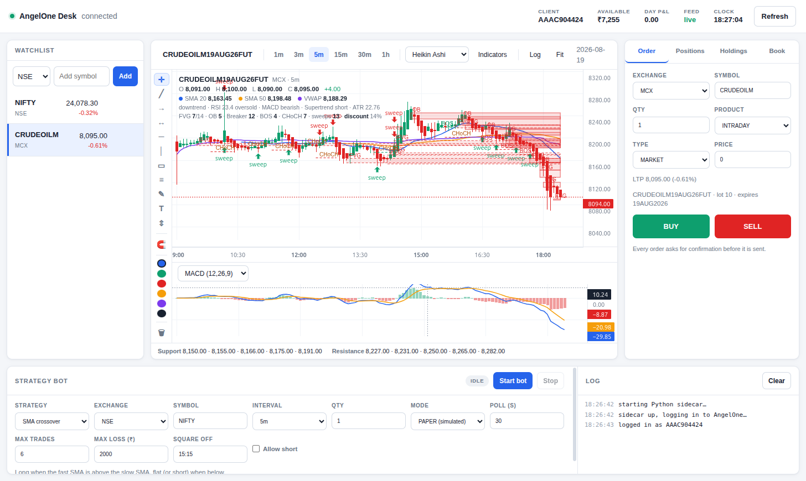

# SmartTrade

An intraday trading desk for [AngelOne SmartAPI](https://smartapi.angelone.in/) —
an Electron front end over a Python backend, built for NSE and MCX.



## What it does

- **Live data** — quotes and ticks stream over AngelOne's SmartWebSocketV2, not polling
- **Charts** — candles / hollow / Heikin Ashi / bars / line / area, 1m–1h, with a
  full drawing toolset (trend lines, rays, Fibonacci, rectangles, measure, text)
- **Indicators** — SMA, EMA, Bollinger, VWAP, Supertrend, RSI, MACD, Stochastic, ATR
- **Smart money concepts** — fair value gaps, order blocks, breakers, BOS/CHoCH,
  swing structure, resting liquidity, equal highs/lows, premium/discount, sweeps
- **Trading** — order ticket with a confirmation dialog on every order, plus
  positions, holdings, order book and funds
- **Strategy bot** — six strategies, paper by default, with risk caps

Instruments resolve by short name: `NIFTY` finds the tradable index, `CRUDEOILM`
finds the current front-month contract and rolls itself as expiries pass.
Session hours follow the exchange — NSE 09:15–15:30, MCX 09:00–23:30.

## Setup

Requires Python 3.10+ and Node 18+.

```bash
python3 -m venv .venv && .venv/bin/pip install -r requirements.txt
cd desktop && npm install
```

Copy `.env.example` to `.env` and fill in your AngelOne API credentials:

```
ANGELONE_API_KEY=...
ANGELONE_CLIENT_ID=...
ANGELONE_MPIN=...
ANGELONE_TOTP_SECRET=...
```

`.env` is gitignored — keep it that way.

## Run

```bash
cd desktop && npm start
```

Electron starts the Python backend itself; there is no separate server to launch.

## Layout

```
angelone_agent/     Python — broker client, indicators, SMC, strategy bot, local API
  client.py           SmartConnect wrapper
  sidecar.py          FastAPI HTTP + WebSocket server (loopback only)
  feed.py             SmartWebSocketV2 live feed and fan-out bus
  analysis.py         Indicator maths
  smc.py              Smart money concepts
  markets.py          Exchange sessions and expiries
  bot.py              Strategy runner
desktop/            Electron app (see desktop/README.md for detail)
scripts/            Standalone CLI analysis scripts
```

The backend binds to 127.0.0.1 on a random port and requires a token Electron
generates at launch. The renderer never receives that token or your credentials —
it talks to the main process over IPC, which proxies through.

## Safety

- Orders are never placed automatically from the ticket; each one opens a
  confirmation dialog first.
- The bot defaults to **PAPER** mode, which simulates fills locally and only
  reads candles. **LIVE** mode is refused by the backend unless the request
  carries an explicit confirmation flag, which the UI sets only after a typed
  confirmation.
- Risk caps — max trades, max daily loss, and a square-off time that flattens
  any open position — apply in both modes.

This is personal trading software, not investment advice. Use at your own risk.

## Licence

Unlicensed / all rights reserved. `desktop/renderer/vendor/lightweight-charts.js`
is [lightweight-charts](https://github.com/tradingview/lightweight-charts) by
TradingView, Apache-2.0.
